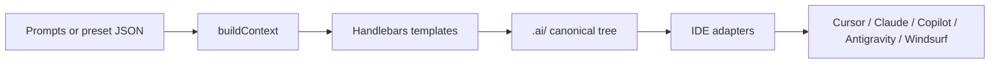

# Visual architecture — FARE

## High-level pipeline

## Context derivation (examples)

| Answer field | Derived flags |
|--------------|----------------|
| `metaFramework: nextjs` | `isNextJS`, `buildCommand: next build` |
| `styling: tailwind` | `hasTailwind` |
| `stateManagement: zustand` | `hasZustand`, `storeDir: src/stores` |

## Cursor adapter

Rule basename → optional `globs:` in `.mdc`; otherwise `alwaysApply: true`.

## Sample stacks

1. **React + Next.js + Tailwind + Cursor** — App Router notes in `routing` + `environment`; globs include `app/**/*.tsx`.  
2. **Vue + Nuxt + Pinia + Claude Code** — Nuxt runtime config; composables in data-fetching globs.  
3. **SvelteKit + Playwright** — `src/routes/` in domain-map defaults.

## Partial reuse

`buildCommands`, `testCommands`, `gitRules`, `componentPatterns`, `stylingPatterns` included from multiple rules and agent context.
