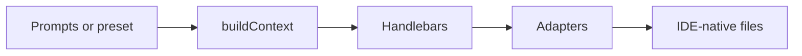

# How it works

## Pipeline

1. **Answers** — UI framework drives filtered choices (e.g. Pinia only for Vue).  
2. **Context** — Boolean flags and commands (`buildCommand`, `testCommand`, `e2eCommand`, directory hints).  
3. **Templates** — `templates/**/*.hbs` render Markdown in memory — nothing intermediate is written to disk.  
4. **Adapters** — Each selected IDE adapter writes its native files directly from that in-memory context: Cursor `.mdc` rules, `CLAUDE.md`, Copilot instructions, Windsurf rules, or Antigravity workflows.

## Example conditional

Templates use Handlebars conditionals (for example, checking **isNextJS**) for App Router guidance vs generic Vite SPAs.

## Presets

JSON under `presets/` matches the full answer shape — ideal for CI or team defaults.

**Next:** [Installation](/guide/3-installation).
