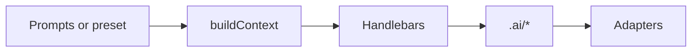

# How it works

## Pipeline

1. **Answers** — UI framework drives filtered choices (e.g. Pinia only for Vue).  
2. **Context** — Boolean flags and commands (`buildCommand`, `testCommand`, `e2eCommand`, directory hints).  
3. **Templates** — `templates/**/*.hbs` render into `.ai/`.  
4. **Adapters** — Read `.ai/` and emit IDE-specific files (e.g. Cursor `.mdc` with globs).

## Example conditional

Templates use Handlebars conditionals (for example, checking **isNextJS**) for App Router guidance vs generic Vite SPAs.

## Presets

JSON under `presets/` matches the full answer shape — ideal for CI or team defaults.

**Next:** [Installation](/guide/3-installation).
