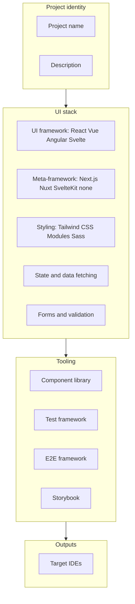

# Usage

## Try it in 2 minutes

Run the React/Vite/Tailwind preset into a throwaway folder:

```bash
npx frontend-ai-starter-recipes --preset react-vite-tailwind --output ./my-app
```

Then inspect the IDE adapter files generated by the preset:

```text
my-app/
├── .cursor/
│   ├── rules/
│   │   ├── index.mdc          # agent identity + quality gates
│   │   ├── architecture.mdc
│   │   ├── components.mdc
│   │   └── … (13 rule files)
│   └── skills/
│       ├── think/
│       ├── plan/
│       └── … (7 lifecycle stages)
└── CLAUDE.md                  # if Claude Code was also selected
```

::: tip What gets generated depends on your IDE selection
Each adapter writes only its own native files. Select multiple IDEs and all their formats appear side by side.
:::

Use `fare --preset react-vite-tailwind --output ./my-app` after a global install.

## Two modes

| Mode | When to use |
|------|-------------|
| **Interactive** | First time, or a custom stack not covered by a preset |
| **`--preset`** | CI, docs, or a known stack (React + Vite, Next.js, etc.) |

## Interactive flow (grouped)

The CLI walks through **project identity → UI stack → tooling → outputs**. Roughly:



::: tip What you will be asked
- **UI framework:** React, Vue, Angular, Svelte  
- **Meta-framework:** Next.js, Nuxt, SvelteKit, Remix, or none (SPA)  
- **Styling:** Tailwind CSS, CSS Modules, Sass / SCSS, or none  
- **Component library:** shadcn/ui, Radix, Material UI, PrimeVue, Angular Material, or none  
- **State management:** Zustand, Pinia, NgRx, Svelte stores, Redux Toolkit, or none  
- **Data fetching:** TanStack Query, SWR, Apollo, RTK Query, or none  
- **Forms:** React Hook Form, VeeValidate, Angular reactive forms, or none  
- **Validation:** Zod, Yup, Valibot, or none  
- **Tests:** Vitest, Jest, Karma  
- **E2E:** Playwright, Cypress, or none  
- **Storybook:** yes or no  
- **IDEs:** Cursor, Claude Code, VS Code Copilot, Antigravity, Windsurf, or all  
:::

If you omit `--output`, the CLI prompts for a directory (and warns if it is non-empty).

## Preset coverage

| Preset | Stack (summary) |
|--------|-----------------|
| `react-vite-tailwind` | React SPA, Vite, Tailwind, shadcn/ui, Zustand, TanStack Query, React Hook Form, Storybook, Vitest, Playwright |
| `nextjs-shadcn` | Next.js, Tailwind, shadcn/ui, Zustand, TanStack Query, React Hook Form, Storybook, Vitest, Playwright |
| `vue-nuxt-pinia` | Vue, Nuxt, Tailwind, PrimeVue, Pinia, TanStack Query, VeeValidate, Storybook, Vitest, Cypress |
| `svelte-kit` | SvelteKit, Tailwind, Svelte stores, Vitest, Playwright |
| `angular-material` | Angular, Angular Material, NgRx, reactive forms, Jest, Cypress |

::: code-group

```bash [react-vite-tailwind]
npx frontend-ai-starter-recipes --preset react-vite-tailwind --output ./my-app
```

```bash [nextjs-shadcn]
npx frontend-ai-starter-recipes --preset nextjs-shadcn --output ./my-nextjs-app
```

```bash [vue-nuxt-pinia]
npx frontend-ai-starter-recipes --preset vue-nuxt-pinia --output ./my-vue-app
```

```bash [svelte-kit]
npx frontend-ai-starter-recipes --preset svelte-kit --output ./my-svelte-app
```

```bash [angular-material]
npx frontend-ai-starter-recipes --preset angular-material --output ./my-angular-app
```

:::

## CLI flags

| Flag | Short | Description |
|------|-------|-------------|
| `--output <dir>` | `-o` | Output directory (skips the path prompt) |
| `--preset <name>` | `-p` | Use a JSON preset from the package's `presets/` folder |

## Minimal example

```bash
npx frontend-ai-starter-recipes --preset react-vite-tailwind --output ./ui
```

You should see IDE adapter files depending on the preset's IDE selection:

```text
ui/
├── .cursor/           # if Cursor was selected in preset
│   ├── rules/*.mdc
│   └── skills/*/
├── CLAUDE.md          # if Claude Code was selected
└── …                  # one folder per selected IDE adapter
```

Preset defaults include specific IDEs; customize via interactive run or by editing a copied preset JSON for your fork.

## Known Limitations

- This is an early community release intended for developer testing and feedback.
- Presets are opinionated starting points, not proof that every team using that stack should follow the same rules.
- Generated rules and lifecycle files should be reviewed and edited inside your real repo before treating them as authoritative.
- IDE adapters depend on how each AI tool reads repository context; behavior may differ across tool versions.
- The CLI creates AI instructions, lifecycle guidance, rules, and IDE adapter files. It does not scaffold a complete frontend app.

**Next:** [Understanding the output](/guide/5-the-output).
