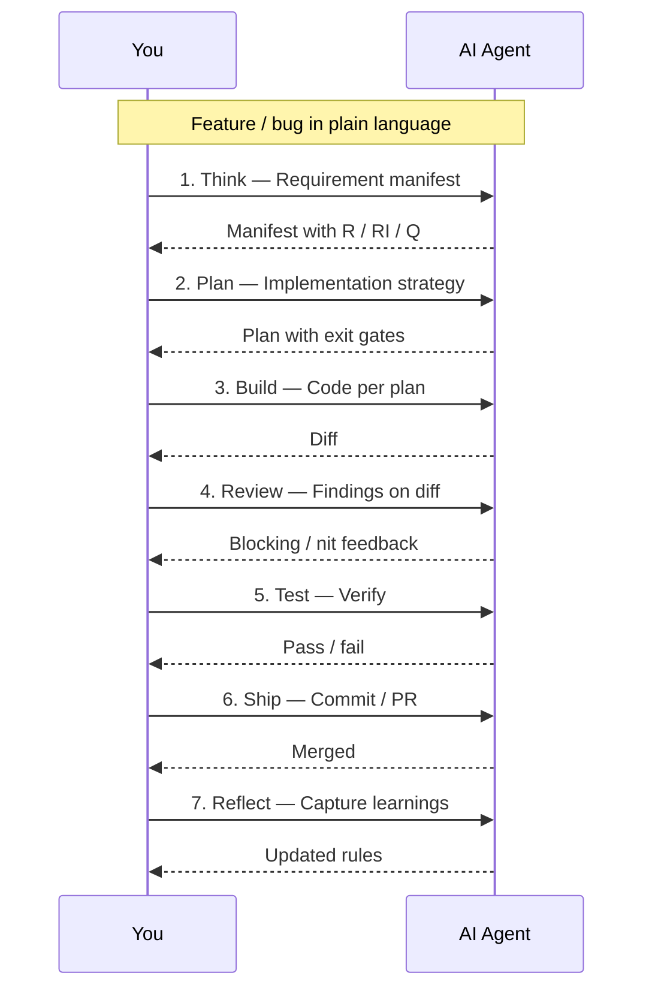

# Recommended workflow

Every feature lives inside the same repeatable loop. The seven lifecycle stages are encoded in the files Fare generated — your IDE loads them at startup; you invoke them by name.

## Step-by-step

### 1. Think — clarify requirements before touching code

Invoke the **Think** skill and paste your prompt, ticket, or feature description. The agent will ask clarifying questions and produce a **Requirement Manifest** — a numbered list of explicit requirements (R), implicit constraints (RI), assumptions (A), and open questions (Q).

::: tip Invoke
In **Cursor**: type `/think` in Agent chat.  
In **Claude Code**: run `/think` from the command palette.  
In **VS Code Copilot**: reference the `Think` section in `copilot-instructions.md`.  
In **Windsurf**: open `.windsurf/rules/lifecycle-think.md`.  
In **Antigravity**: open `.agents/workflows/think.md`.
:::

**Iterate here.** Push back on vague requirements, resolve every Q-item, and revise the manifest until there is no ambiguity left. A tight manifest is the contract the plan and build phases reference strictly. Starting a build without a resolved manifest is the single most common source of mid-feature rework.

---

### 2. Plan — turn requirements into an actionable implementation strategy

Invoke the **Plan** skill and hand it the manifest from Think. The agent produces a structured plan covering file scope, component breakdown, data flow, routing changes, state shape, accessibility constraints, and an acceptance gate per requirement.

::: tip Invoke
In **Cursor**: type `/plan` in Agent chat.  
In **Claude Code**: run `/plan`.  
In other adapters, use the equivalent path your adapter created (see [Understanding the output](./5-the-output.md)).
:::

**Review the plan before agreeing.** Verify that every R-ID from the manifest appears in the plan, that the approach fits your architecture rule (`architecture.mdc`), and that nothing was silently deferred. Approve explicitly — the build phase treats the approved plan as ground truth and will not deviate from it.

---

### 3. Build — implement strictly against the approved plan

Invoke the **Build** skill. The agent reads your approved plan and follows your generated rules — architecture, components, styling and accessibility, routing, state and data fetching, forms and validation, performance and testing, SEO, errors and logging, security, environment, and git conventions — then writes the code.

::: tip Invoke
In **Cursor**: type `/build` in Agent chat.  
In **Claude Code**: run `/build`.  
In other adapters, use the equivalent path your adapter created.
:::

**Scope discipline.** If a new requirement surfaces mid-build, stop. Add it to the manifest, update the plan, then resume. Build closes when every R-ID has a corresponding code change and the local test suite passes. Do not ship a build that skipped a plan item — it becomes a defect or a debt.

---

### 4. Review — audit the diff against your quality gates

Invoke the **Review** skill against the diff. The agent runs a structured checklist drawn from your rules: component contract and prop types, accessibility (ARIA roles, keyboard navigation, colour contrast), performance budget (bundle size, render cost, image optimisation), error boundaries and fallback states, security (XSS, CSRF, CSP headers), routing correctness, and git conventions.

::: tip Invoke
In **Cursor**: type `/review` in Agent chat.  
In **Claude Code**: run `/review`.
:::

Fix every **blocking** finding before moving forward. Nit-level items can be deferred but should be captured in a follow-up ticket — not ignored. A clean review pass is the gate to Test; skipping it means your human reviewers will spend time on issues the agent could have caught.

---

### 5. Test — verify with automated tests and manual checks

Invoke the **Test** skill. The agent will:

- Write or update **unit tests** for changed components, hooks, and utilities.
- Add **integration tests** for any data-fetching or routing changes.
- Verify that coverage thresholds configured in your project are met.
- Produce a **manual verification checklist** for the changes: happy path, edge cases from the manifest, responsive behaviour, accessibility at the browser level, and a Lighthouse check where relevant.

::: tip Invoke
In **Cursor**: type `/test` in Agent chat.  
In **Claude Code**: run `/test`.
:::

**Manual verification is not optional for UI changes.** Walk the happy path and at least two edge cases from the manifest yourself. Record the outcome before calling this phase done. "Tests pass" and "the feature works" are different statements.

---

### 6. Ship — create the PR, update docs, prepare the release

Invoke the **Ship** skill. The agent will:

- Draft a commit message following your `git-conventions` rule.
- Open a pull request (via `gh` where available) with a structured description — intent, major changes, evidence, and review notes.
- Check for changelog or documentation entries that need updating.
- Flag any release-tag, version bump, or deployment steps your project requires.

::: tip Invoke
In **Cursor**: type `/ship` in Agent chat.  
In **Claude Code**: run `/ship`.
:::

Ship means the PR is open and reviewable — not that it is merged. CI runs here. Do not approve until CI is green and at least one human has read the review notes. The agent's structured PR description is for your reviewer, not for process compliance.

---

### 7. Reflect — close the loop and sharpen your rules permanently

Invoke the **Reflect** skill after the PR merges, or after any session where the agent drifted noticeably from your conventions. The agent will ask you to cite the mistakes, repeated corrections, or gaps that occurred during this feature. It produces a **learning document** that is saved alongside your rules.

::: tip Invoke
In **Cursor**: type `/reflect` in Agent chat.  
In **Claude Code**: run `/reflect`.
:::

**Reflect is the compounding step.** Each learning entry makes your generated rules sharper for every future session. If the agent made the same mistake twice, Reflect is where you fix it permanently — not in the chat context, but in the rule file that every future session loads. Over time this is what turns a generic agent into one that understands your codebase.

---

## After generation

1. Open the **agent file** your IDE generated (`CLAUDE.md`, `.cursor/rules/index.mdc`, `.github/copilot-instructions.md`, etc.) and fill in your real domain names, folder layout, and project-specific constraints.
2. Review the generated **rules** for your stack — edit any rule that doesn't match your team's actual conventions before your first session.
3. Use Reflect proactively. Every time the agent repeats a mistake or drifts from your conventions, that is a signal to sharpen the corresponding rule file — one edit, fixed for every future session.

---

[Contributing & support](/community/contributing)
