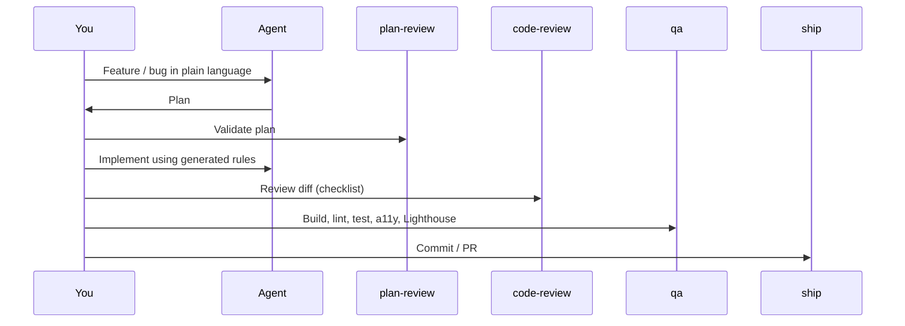

# Recommended workflow

## After generation

1. Review the generated agent instructions in your IDE (e.g. `.cursor/rules/index.mdc` for Cursor, `CLAUDE.md` for Claude Code). Edit the domain map and tech stack sections to reflect your real project.
2. When the model repeats the same mistake — add or tighten the relevant rule file and re-run the CLI with `--write-mode overwrite` to update.

## Bonus skills

- **performance-audit** — CWV, bundle, images  
- **accessibility-audit** — axe, keyboard, screen reader  
- **component-audit** — props, complexity, Storybook coverage  
- **dependency-audit** — security, licenses, bundle impact  

---

[Contributing & support](/community/contributing)
