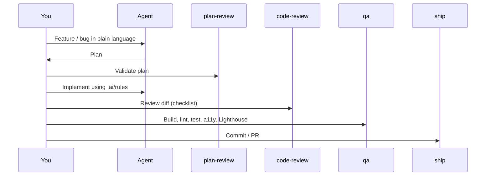

# Recommended workflow

## After generation

1. Edit **`.ai/context/domain-map.md`** with real domains and paths.  
2. Lock **`.ai/context/tech-stack.md`** to libraries you allow.  
3. Use **`.ai/tracking/efficiency.md`** when the model repeats the same mistake — update a rule.

## Bonus skills

- **performance-audit** — CWV, bundle, images  
- **accessibility-audit** — axe, keyboard, screen reader  
- **component-audit** — props, complexity, Storybook coverage  
- **dependency-audit** — security, licenses, bundle impact  

---

[Contributing & support](/community/contributing)
